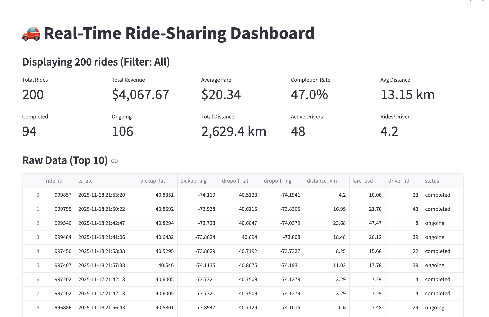

# Real-Time Ride-Sharing Data Pipeline

A real-time data streaming system that simulates ride-sharing data using Apache Kafka, PostgreSQL, and Streamlit.

## Project Structure

```
ids706_kafka
├── docker-compose.yml    
├── requirements.txt      
├── producer.py          
├── consumer.py          
├── dashboard.py         
└── README.md          

```

## Features

- **Real-time data generation**: Simulates ride-sharing events with pickup/dropoff coordinates, fares, and distances
- **Stream processing**: Apache Kafka handles message queuing
- **Data persistence**: PostgreSQL stores ride records
- **Live dashboard**: Streamlit provides auto-refreshing visualizations

## Prerequisites

- Docker and Docker Compose
- Python 3.8+
- pip

## Setup Instructions

### 1. Start Infrastructure

```bash
docker compose up -d
```

### 2. Install Python Dependencies

```bash
pip install -r requirements.txt
```

### 3. Run the Consumer

Open a terminal and run:

```bash
python consumer.py
```

You should see:
```
[Consumer] Connecting to Kafka at localhost:9092...
[Consumer] ✓ Connected to Kafka successfully!
[Consumer] Connecting to PostgreSQL...
[Consumer] ✓ Connected to PostgreSQL successfully!
[Consumer] ✓ Table 'rides' ready.
[Consumer] 🎧 Listening for messages...
```

Keep this terminal open.

### 4. Run the Producer

Open a new terminal and run:

```bash
python producer.py
```

You should see messages like:
```
[Producer] Sent ride: {'ride_id': 654321, 'timestamp': '2025-11-17T10:30:45.123456', ...}
```

Keep this terminal open.

### 5. Run the Dashboard

Open a third terminal and run:

```bash
streamlit run dashboard.py
```

The dashboard will open in your browser at `http://localhost:8501`

## Dashboard Features

### Key Metrics
- **Total Rides**: Count of all rides in the system
- **Total Revenue**: Sum of all fares
- **Average Fare**: Mean fare per ride
- **Completion Rate**: Percentage of completed rides
- **Average Distance**: Mean distance per ride
- **Active Drivers**: Number of unique drivers
- **Rides per Driver**: Average rides per driver

### Visualizations
1. **Revenue by Ride Status**: Bar chart showing revenue breakdown
2. **Top 10 Most Active Drivers**: Bar chart of driver activity
3. **Distance Distribution**: Histogram of ride distances
4. **Fare Distribution**: Histogram of ride fares
5. **Pickup Locations Map**: Interactive map showing ride origins
6. **Cumulative Rides Over Time**: Line chart of ride volume

## Stopping the System

1. Stop the Streamlit dashboard: Press `Ctrl+C` in the dashboard terminal
2. Stop the producer: Press `Ctrl+C` in the producer terminal
3. Stop the consumer: Press `Ctrl+C` in the consumer terminal
4. Stop Docker services: `docker-compose down`

## Screenshot of the dashboard
